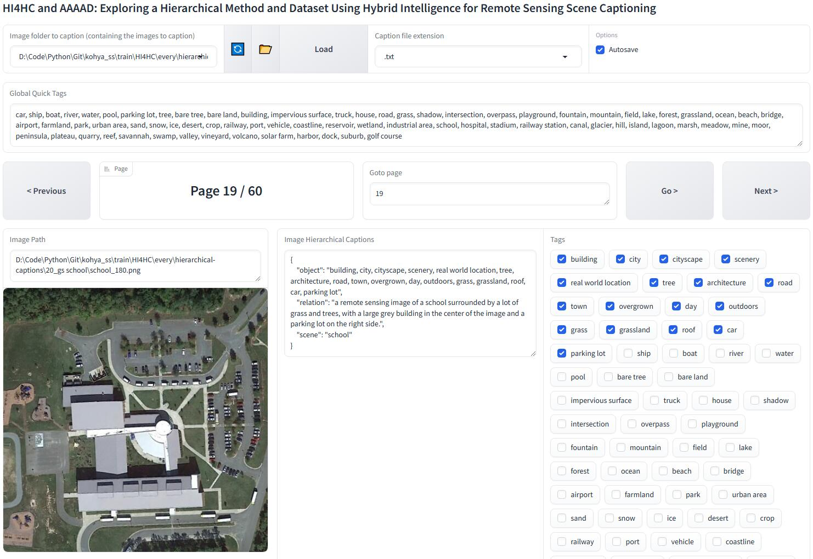
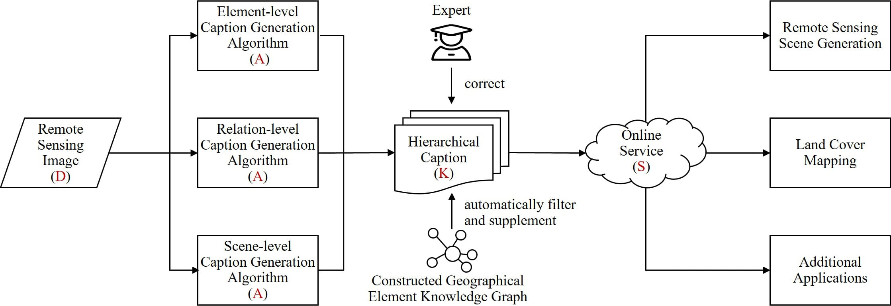
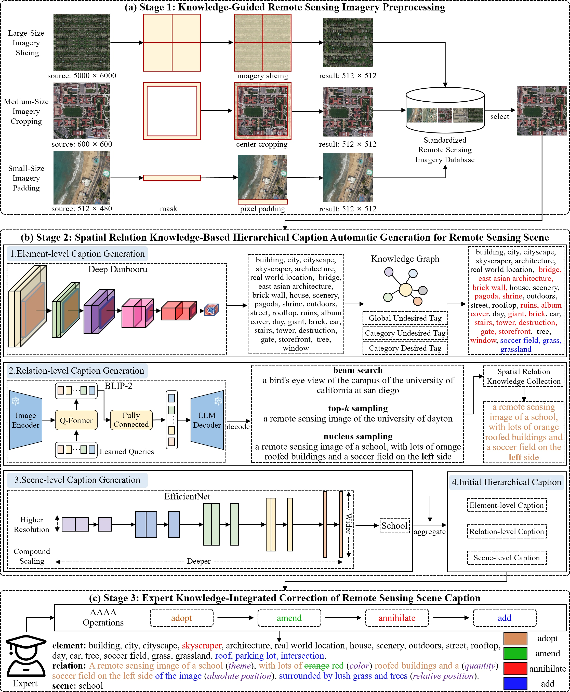
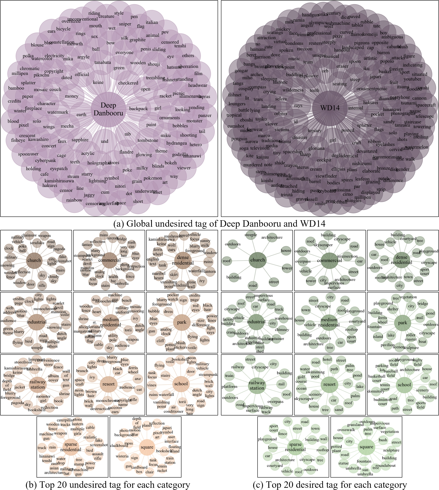
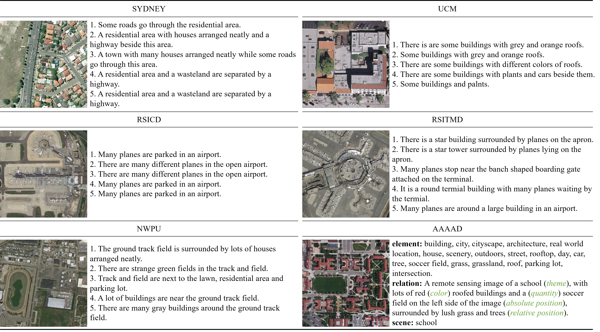
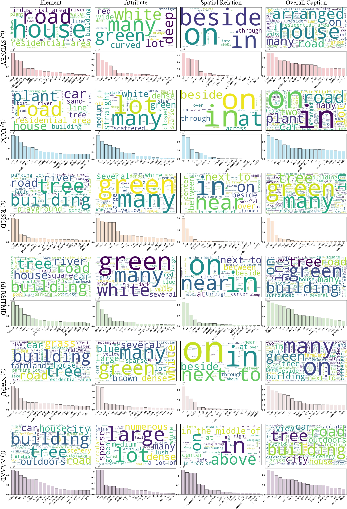
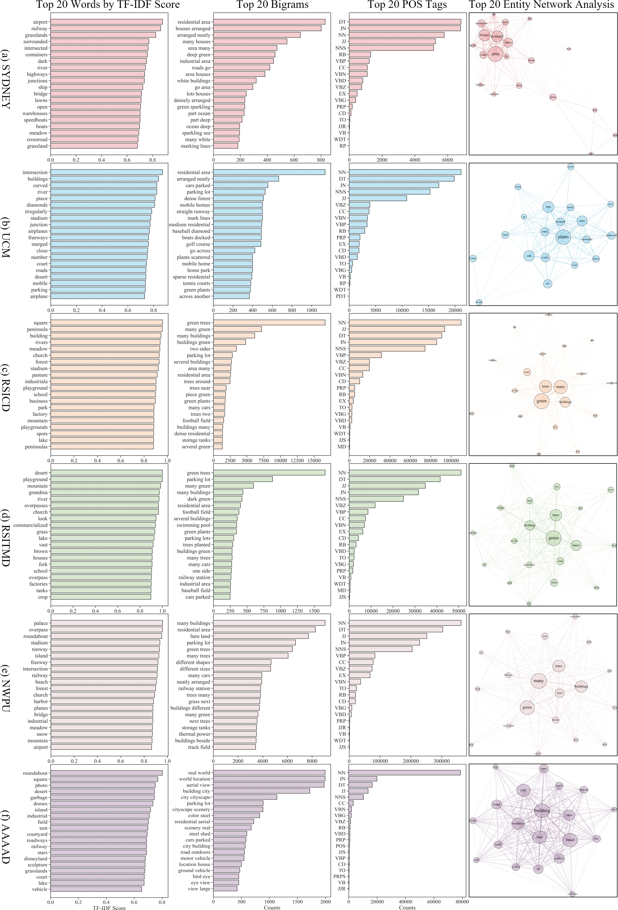
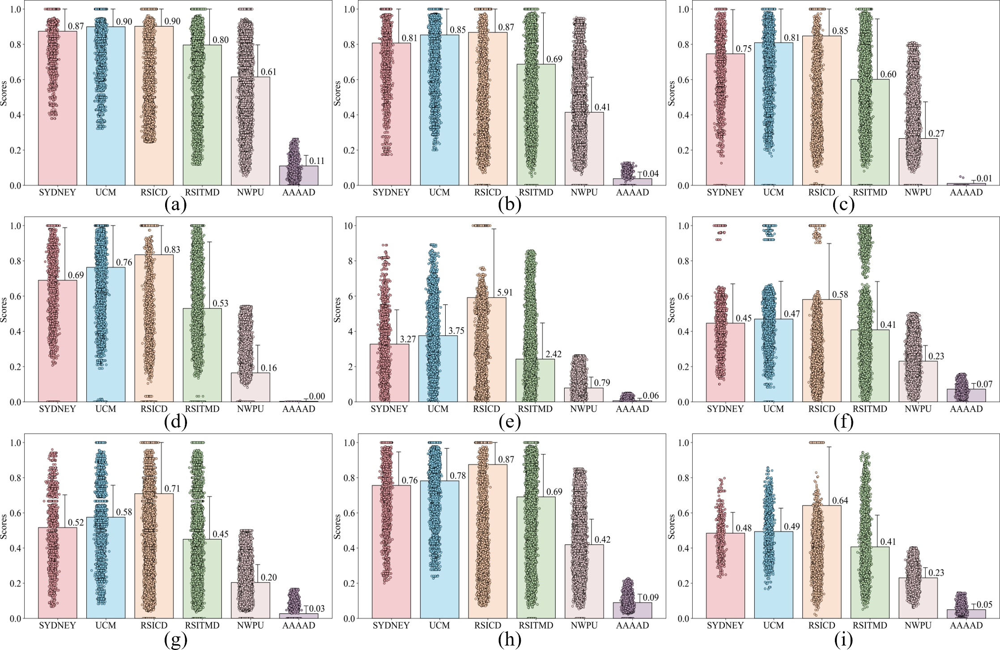
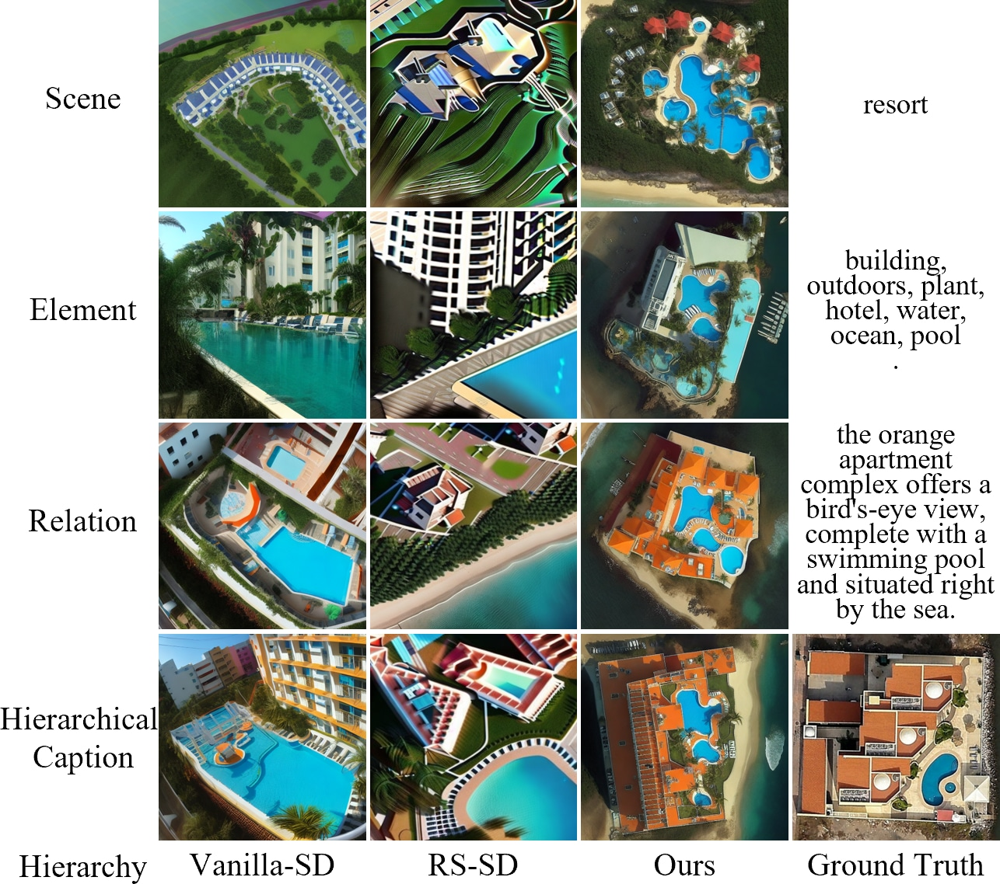

<h1 align="center">HI4HC and AAAAD: Exploring a Hierarchical Method and Dataset Using Hybrid Intelligence for Remote Sensing Scene Captioning</h1>

    
This is the official PyTorch implementation of the paper **[HI4HC and AAAAD: Exploring a Hierarchical Method and Dataset Using Hybrid Intelligence for Remote Sensing Scene Captioning]()**.

- Our WebUI for automatically filtering and supplementing geographical element labels for GUT, CUT, and CDT:



Note: The code and dataset models will be released upon acceptance of the paper.

### Table of content
1. [Overall Strategy for Hierarchical Captioning for Remote Sensing Scenes](#Strategy)
2. [HI4HC: Hybrid Intelligence for Remote Sensing Scene Hierarchical Captioning](#HI4HC)
3. [AAAAD: A Hierarchical Caption Dataset for Remote Sensing Scene Based on Hybrid Intelligence](#AAAAD)
4. [Paper](#paper)
5. [Acknowledgement](#acknowledgement)
6. [License](#license)

### 1.Overall Strategy for Hierarchical Captioning for Remote Sensing Scenes  <a name="Strategy"></a>



### 2.HI4HC: Hybrid Intelligence for Remote Sensing Scene Hierarchical Captioning <a name="HI4HC"></a>



- Global and category knowledge graphs used for automatic cleansing and supplementing geographical element labels.


### 3.AAAAD: A Hierarchical Caption Dataset for Remote Sensing Scene Based on Hybrid Intelligence <a name="AAAAD"></a>

- Qualitative comparison between existing RSI caption datasets and AAAAD (ours). 


- Quantitative statistical results of AAAAD.


- Quantitative comparison between AAAAD and existing remote sensing caption datasets.


- Comparison of AAAAD and existing remote sensing caption datasets across different dimensions (element, attributes, spatial relations).


- Statistical analysis of AAAAD and existing remote sensing caption datasets.


- Comparison of semantic similarity between AAAAD and existing remote sensing caption datasets.


- Direct comparison of remote sensing scenes generated by different algorithms using traditional single-level captions and hierarchical captions as prompts.


  
You can download AAAAD for a quick look.
  - AAAAD: [Google Drive]() or [Baidu NetDisk]()


### 4.Paper <a name="paper"></a>
**[HI4HC and AAAAD: Exploring a Hierarchical Method and Dataset Using Hybrid Intelligence for Remote Sensing Scene Captioning]()**

Please cite the following paper if you find it useful for your research:
```
@article{ren2024hi4hc,
  title={HI4HC and AAAAD: Exploring a Hierarchical Method and Dataset Using Hybrid Intelligence for Remote Sensing Scene Captioning},
  author={Jiaxin Ren, Wanzeng Liu, Jun Chen, Shunxi Yin, and Yuan Tao},
  year={2024}
}
```

### 5.Acknowledgement <a name="acknowledgement"></a>
+ [Kohya's GUI](https://github.com/bmaltais/kohya_ss). This repository primarily provides a Gradio GUI for Kohya's Stable Diffusion trainers. Moreover, we drew inspiration from its annotator's WebUI to implement automatic filtering of geographical element labels for GUT, CUT, and CDT.
+ [Deep Danbooru](https://github.com/KichangKim/DeepDanbooru). A deep learning model trained on the Danbooru dataset using the ResNet architecture, specifically designed for recognizing and tagging content and attributes in anime-style images.
+ [WD14](https://huggingface.co/SmilingWolf/wd-v1-4-vit-tagger). An advanced version of Deep Danbooru, combining a larger dataset and deeper network structure to support a broader range of tags and improve tag prediction accuracy.
+ [BLIP-2](https://github.com/salesforce/LAVIS/tree/main/projects/blip2). A model that unifies the framework for visual-language pre-training and fine-tuning, enabling multimodal learning and cross-modal understanding. 


### 7.License <a name="license"></a>
This repo is distributed under [MIT License](). The code can be used for academic purposes only.
