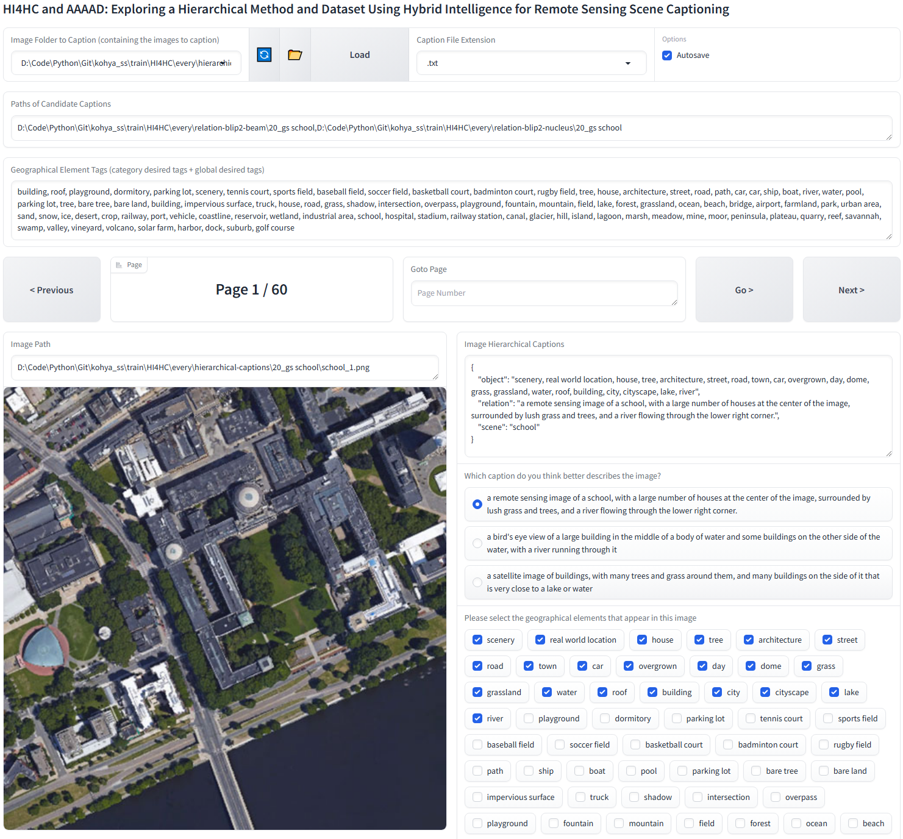
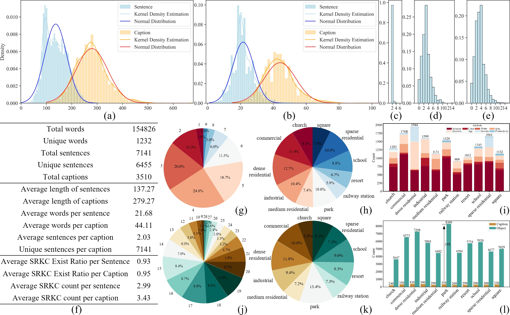

<h1 align="center">HI4HC and AAAAD: Exploring a Hierarchical Method and Dataset Using Hybrid Intelligence for Remote Sensing Scene Captioning</h1>

    
This is the official PyTorch implementation of the paper **[HI4HC and AAAAD: Exploring a Hierarchical Method and Dataset Using Hybrid Intelligence for Remote Sensing Scene Captioning]()**.

### :fire: Updates
* **[2024.12.10]** We have released AAAAD, feel free to use it!


### :star: Visualization
- Our HI4HC-WebUI for automatically filtering and supplementing geographical element labels for GUT, CUT, and CDT:

- [Demonstration Video of HI4HC-WebUI](https://github.com/user-attachments/assets/f2f6e5a1-b062-4564-8434-81ce02fd2d0f)


Note: The complete code will be released after the paper is accepted.

### Table of content
1. [Overall Strategy for Hierarchical Captioning for Remote Sensing Scenes](#Strategy)
2. [HI4HC: Hybrid Intelligence for Remote Sensing Scene Hierarchical Captioning](#HI4HC)
3. [AAAAD: A Hierarchical Caption Dataset for Remote Sensing Scene Based on Hybrid Intelligence](#AAAAD)
4. [Paper](#paper)
5. [Acknowledgement](#acknowledgement)
6. [License](#license)

### 1.Overall Strategy for Hierarchical Captioning for Remote Sensing Scenes  <a name="Strategy"></a>


### 2.HI4HC: Hybrid Intelligence for Remote Sensing Scene Hierarchical Captioning <a name="HI4HC"></a>


- Global and category knowledge graphs used for automatic cleansing and supplementing geographical element labels.


### 3.AAAAD: A Hierarchical Caption Dataset for Remote Sensing Scene Based on Hybrid Intelligence <a name="AAAAD"></a>

#### How to use AAAAD?

The `AAAAD` dataset consists of two parts: a remote sensing imagery dataset and a hierarchical description dataset. The remote sensing imagery dataset is derived from the `AID` dataset, while the hierarchical caption dataset includes geographical element captions, spatial relation captions, and scene-level captions.

1. Download the remote sensing imagery dataset from `AAAAD`:
   The remote sensing imagery in `AAAAD` is sourced from the `AID` dataset. You can either download the [AID dataset](https://captain-whu.github.io/AID/) and preprocess (center-cropped) it to 512x512 resolution or directly download our preprocessed version:

   - `Dataset_AAAAD_Imagery`: [Hugging Face](https://huggingface.co/datasets/jaycecd/AAAAD/tree/main) or [Baidu NetDisk](https://pan.baidu.com/s/15YtYMTwy0AacojCzraXBxQ) (code: cjql)

2. Download the hierarchical description dataset from `AAAAD`:
   - The `Dataset_AAAAD_Hierarchical_Caption.json` file in this repository contains the hierarchical caption dataset of `AAAAD`, structured as follows:

```json
{
    "dataset": "AAAAD",
    "category": 
    {
        "church": 
        [
            {
                "image_id": 1,
                "file_name": "church_1.png",
                "split": "test",
                "hierarchical_caption": 
                {
                    "object": "building, city, cityscape, skyscraper, scenery, architecture, library, tower, street, real world location, town, outdoors, road, house, from above, car, tree, water, fountain",
                    "relation": "this aerial photo depicts a city area with multiple buildings and structures. the most striking feature is a large elliptical building with a blue-green roof, possibly a stadium or auditorium. surrounding this central structure are various other buildings of different shapes and sizes, including a semi-circular design adjacent to the elliptical structure.",
                    "scene": "commercial"
                }
            }
        ]
    }
}

```


- Qualitative comparison between existing RSI caption datasets and AAAAD (ours). 


- Quantitative statistical results of AAAAD.


- Quantitative comparison between AAAAD and existing remote sensing caption datasets.


- Comparison of AAAAD and existing remote sensing caption datasets across different dimensions (element, attributes, spatial relations).


- Statistical analysis of AAAAD and existing remote sensing caption datasets.


- Comparison of semantic similarity between AAAAD and existing remote sensing caption datasets.


- Direct comparison of remote sensing scenes generated by different algorithms using traditional single-level captions and hierarchical captions as prompts.


  

### 4.Paper <a name="paper"></a>
**[HI4HC and AAAAD: Exploring a Hierarchical Method and Dataset Using Hybrid Intelligence for Remote Sensing Scene Captioning]()**

Please cite the following paper if you find it useful for your research:
```
@article{ren2024hi4hc,
  title={HI4HC and AAAAD: Exploring a Hierarchical Method and Dataset Using Hybrid Intelligence for Remote Sensing Scene Captioning},
  author={Jiaxin Ren, Wanzeng Liu, Jun Chen, Shunxi Yin, and Yuan Tao},
  year={2024}
}
```

### 5.Acknowledgement <a name="acknowledgement"></a>
+ [Kohya's GUI](https://github.com/bmaltais/kohya_ss). This repository primarily provides a Gradio GUI for Kohya's Stable Diffusion trainers. Moreover, we drew inspiration from its annotator's WebUI to implement automatic filtering of geographical element labels for GUT, CUT, and CDT.
+ [Deep Danbooru](https://github.com/KichangKim/DeepDanbooru). A deep learning model trained on the Danbooru dataset using the ResNet architecture, specifically designed for recognizing and tagging content and attributes in anime-style images.
+ [WD14](https://huggingface.co/SmilingWolf/wd-v1-4-vit-tagger). An advanced version of Deep Danbooru, combining a larger dataset and deeper network structure to support a broader range of tags and improve tag prediction accuracy.
+ [BLIP-2](https://github.com/salesforce/LAVIS/tree/main/projects/blip2). A model that unifies the framework for visual-language pre-training and fine-tuning, enabling multimodal learning and cross-modal understanding. 


### 7.License <a name="license"></a>
This repo is distributed under [MIT License](). The code can be used for academic purposes only.
